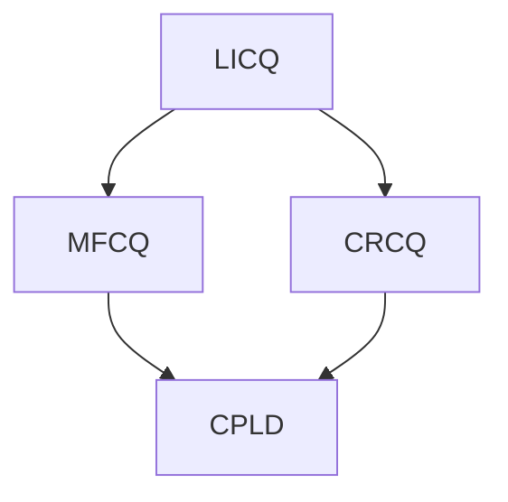

# 經典帶約束優化問題

## Karush–Kuhn–Tucker conditions （KKT條件）

在[數學](https://zh.wikipedia.org/wiki/數學)中，**卡魯什-庫恩-塔克條件**（英語：Karush-Kuhn-Tucker Conditions，常見別名：Kuhn-Tucker，KKT條件，Karush-Kuhn-Tucker最優化條件，Karush-Kuhn-Tucker條件，Kuhn-Tucker最優化條件，Kuhn-Tucker條件）是在滿足一些有規則的條件下，一個[非線性規劃](https://zh.wikipedia.org/wiki/非線性規劃)問題能有[最優化](https://zh.wikipedia.org/wiki/最優化)解法的一個[必要條件](https://zh.wikipedia.org/wiki/必要條件)。這是一個使用[廣義](https://zh.wikipedia.org/wiki/广义化)[拉格朗日函數](https://zh.wikipedia.org/wiki/拉格朗日乘数)的結果。

考慮以下非線式最優化問題：
$$
{\displaystyle \min \limits _{x}\;\;f(x)} \\
s.t.\quad {\displaystyle g_{i}(x)\leq 0,\quad h_{j}(x)=0}
$$
${\displaystyle f(x)}$是需要$\color{red} 最小化$的函數，${\displaystyle g_{i}(x)\ (i=1,\ldots ,m)}$是不等式約束，${\displaystyle h_{j}(x)\ (j=1,\ldots ,l)}$是等式約束，$m$和$l$分別為不等式約束和等式約束的數量。

不等式約束問題的必要和充分條件初見於[威廉·卡魯什](https://zh.wikipedia.org/wiki/威廉·卡魯什)的碩士論文[[1\]](https://zh.wikipedia.org/wiki/卡鲁什-库恩-塔克条件#cite_note-1)，之後在一份由[哈羅德·W·庫恩](https://zh.wikipedia.org/wiki/哈羅德·W·庫恩)及[阿爾伯特·W·塔克](https://zh.wikipedia.org/wiki/阿尔伯特·W·塔克)撰寫的研討生論文[[2\]](https://zh.wikipedia.org/wiki/卡鲁什-库恩-塔克条件#cite_note-2)出現後受到重視。

---

## 必要性

假設有目標函數，即是要被最小化的函數${\displaystyle f:\mathbb {R} ^{n}\rightarrow \mathbb {R} }$，約束函數${\displaystyle g_{i}:\,\!\mathbb {R} ^{n}\rightarrow \mathbb {R} }$及${\displaystyle h_{j}:\,\!\mathbb {R} ^{n}\rightarrow \mathbb {R} }$ 。再者，假設他們都是於$x^*$這點是連續可微的，如果$x^*$是一局部極小值，那麼將會存在一組所謂乘子的常數${\displaystyle \lambda \geq 0}$, ${\displaystyle \mu _{i}\geq 0\ (i=1,\ldots ,m)}$及${\displaystyle \nu _{j}\ (j=1,...,l)}$令到：
$$
{\displaystyle \lambda +\sum _{i=1}^{m}\mu _{i}+\sum _{j=1}^{l}|\nu _{j}|>0,} \\
{\displaystyle \lambda \nabla f(x^{*})+\sum _{i=1}^{m}\mu _{i}\nabla g_{i}(x^{*})+\sum _{j=1}^{l}\nu _{j}\nabla h_{j}(x^{*})=0,} \\
{\displaystyle \mu _{i}g_{i}(x^{*})=0\;{\mbox{for all}}\;i=1,\ldots ,m}
$$

---

## 充分條件

假設目標函數${\displaystyle f:\mathbb {R} ^{n}\rightarrow \mathbb {R} }$及約束函數${\displaystyle g_{i}:\mathbb {R} ^{n}\rightarrow \mathbb {R} }$皆為 [**凸**函數](https://zh.wikipedia.org/wiki/凸函数)，而${\displaystyle h_{j}:\mathbb {R} ^{n}\rightarrow \mathbb {R} }$是一[**仿射**函數](https://zh.wikipedia.org/wiki/仿射变换)，假設有一可行點${\displaystyle x^{*}}$，如果有常數${\displaystyle \mu _{i}\geq 0\ (i=1,\ldots ,m)}$及${\displaystyle \nu _{j}\ (j=1,\ldots ,l)}$令到：
$$
{\displaystyle \nabla f(x^{*})+\sum _{i=1}^{m}\mu _{i}\nabla g_{i}(x^{*})+\sum _{j=1}^{l}\nu _{j}\nabla h_{j}(x^{*})=0}\\
{\displaystyle \mu _{i}g_{i}(x^{*})=0\;{\mbox{for all}}\;i=1,\ldots ,m,}
$$

那麼$x^*$這點是一[全局極小值](https://zh.wikipedia.org/wiki/极值)。

## 正則性條件或約束規範

於上述必要和充分條件中，dual multiplier ${\displaystyle \lambda }$可能是零。當${\displaystyle \lambda }$是零時，這個情況就是退化的或反常的。因此必要和充分條件會將約束的幾何特性而不是將函數自身的特點納入計算。

有一定數量的正則性條件能保證解法不是退化的（即${\displaystyle \lambda \neq 0}$)，它們包括：

- $\color{red}線性獨立約束規範$（Linear independence constraint qualification，LICQ）：有效不等式約束的[梯度](https://zh.wikipedia.org/wiki/梯度)和等式約束的梯度於${\displaystyle x^{*}}$線性獨立。

- $\color{red}Mangasarian-Fromowitz約束規範$（Mangasarian-Fromowitz constraint qualification，MFCQ）：有效不等式約束的梯度和等式約束的梯度於$x^*$正線性獨立。
- $\color{red}常秩約束規範$（Constant rank constraint qualification、CRCQ）：考慮每個有效不等式約束的梯度子集和等式約束的梯度，於$x^*$的鄰近區域的秩（rank）不變。
- $\color{red}常正線性依賴約束規範$（Constant positive linear dependence constraint qualification，CPLD）：考慮每個有效不等式約束的梯度子集和等式約束的梯度，如果它們於$x^*$是正線性依賴，那麼它們於$x^*$的鄰近區域也是正線性依賴。（如果存在${\displaystyle a_{1}\geq 0,\ldots ,a_{n}\geq 0}$ 令到${\displaystyle a_{1}v_{1}+\ldots +a_{n}v_{n}=0}$，那麼${\displaystyle \{v_{1},\ldots ,v_{n}\}}$是正線性依賴)

- $\color{red}斯萊特條件$（Slater condition）：如果問題只包含不等式約束，那麼有一點${\displaystyle x}$ 令到${\displaystyle g_{i}(x)<0} \quad \forall {\displaystyle i=1,\ldots ,m}$ 

雖然MFCQ不等同於CRCQ，但可證出LICQ⇒MFCQ⇒CPLD，LICQ⇒CRCQ⇒CPLD。

於實際情況下，較弱的約束規範會被傾向使用，這是因為$\color{red}較弱的約束規範能提供較強的最優化條件$。

