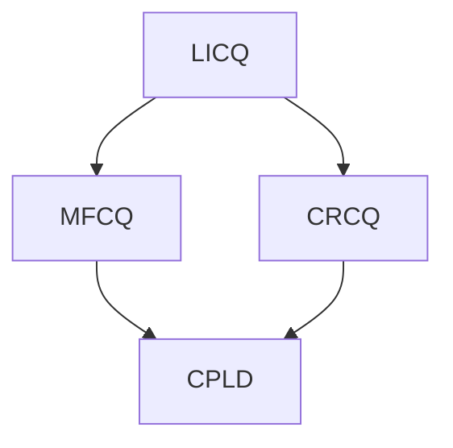

# 经典带约束优化问题回顾

## Karush–Kuhn–Tucker Conditions（KKT 条件）

KKT 条件是<a>非线性约束优化问题</a>中最重要的一组最优性条件。  
它可以看作是无约束优化中“一阶导数为零”条件在**带等式/不等式约束**情形下的推广。

在适当的正则性条件（constraint qualification）下，若 `$x^*$` 是局部最优解，则它通常满足一组关于目标函数、约束函数以及拉格朗日乘子的条件，这就是 KKT 条件。

# 1. 标准优化问题
考虑如下优化问题：
$$
\begin{aligned}
\min_{x \in \mathbb{R}^n} \quad & f(x) \\
\text{s.t.} \quad 
& g_i(x) \le 0, \quad i=1,\dots,m,\\
& h_j(x) = 0, \quad j=1,\dots,l.
\end{aligned}
$$

其中：
- $f(x)$：目标函数
- $g_i(x)$：不等式约束
- $h_j(x)$：等式约束

我们称满足所有约束的点 `$x$` 为`可行点（feasible point）`。

# 2. 拉格朗日函数

为处理约束，引入拉格朗日乘子：
- $\mu_i \ge 0$：对应不等式约束 $g_i(x)\le 0$
- $\nu_j \in \mathbb{R}$：对应等式约束 $h_j(x)=0$

定义`拉格朗日函数`：

$$
\mathcal{L}(x,\mu,\nu)
=
f(x)
+
\sum_{i=1}^m \mu_i g_i(x)
+
\sum_{j=1}^l \nu_j h_j(x).
$$

# 3. KKT 条件

若 `$x^*$` 是局部最优解，并且满足适当的约束资格条件，则存在乘子 `$\mu^*$` 与 `$\nu^*$`，使得以下条件成立：

## 3.1 原始可行性（Primal Feasibility）

$$
g_i(x^*) \le 0,\quad i=1,\dots,m \\

h_j(x^*) = 0,\quad j=1,\dots,l
$$

即 `$x^*$` 本身必须是可行点。

## 3.2 对偶可行性（Dual Feasibility）

$$
\mu_i^* \ge 0,\quad i=1,\dots,m
$$

这是`不等式约束`乘子的符号条件。

## 3.3 驻点条件（Stationarity）

$$
\nabla f(x^*)
+
\sum_{i=1}^m \mu_i^* \nabla g_i(x^*)
+
\sum_{j=1}^l \nu_j^* \nabla h_j(x^*)
=0
$$

这相当于“带约束的一阶最优条件”。

## 3.4 互补松弛（Complementary Slackness）

$$
\mu_i^* g_i(x^*) = 0,\quad i=1,\dots,m
$$

它表示：

- 若某个不等式约束不活跃（`$g_i(x^*)<0$`），则对应 `$\mu_i^*=0$`
- 若某个不等式约束对应 `$\mu_i^*>0$`，则该约束必须活跃（`$g_i(x^*)=0$`）

# 4. KKT 条件的直观理解

KKT 条件的核心思想是：

- 最优点不能沿着可行方向继续下降
- 因此，`目标函数梯度必须能够由“活跃约束的梯度”线性组合表示`

也就是说，在最优点附近，约束“挡住了”继续下降的方向。

# 5. 何时 KKT 是必要条件？

一般来说，KKT 条件是`局部最优解的必要条件`，但需要附加一定的正则性条件。  
否则，即使 `$x^*$` 是最优点，也可能找不到满足 KKT 的乘子。

因此，正确的表述通常是：

> 在可微性与适当约束资格条件成立时，局部极小点满足 KKT 条件。

# 6. 何时 KKT 也是充分条件？

若问题是**凸优化问题**，则 KKT 条件不仅是必要的，也是充分的。

更具体地说，若：

- $f(x)$ 是凸函数
- 每个 $g_i(x)$ 是凸函数
- 每个 $h_j(x)$ 是仿射函数（线性函数加常数）

那么只要存在点 $x^*$ 与乘子 $(\mu^*,\nu^*)$ 满足 KKT 条件，就可以断定：

$$
x^* \text{ 是全局最优解。}
$$

# 7. 约束资格条件（Constraint Qualification, CQ）

KKT 之所以成立，通常需要额外的“正则性假设”。这些假设统称为**约束资格条件**。

## 7.1 LICQ

**线性无关约束资格条件**（Linear Independence Constraint Qualification）

在 $x^*$ 处，所有活跃不等式约束的梯度与等式约束的梯度线性无关。

## 7.2 MFCQ

**Mangasarian–Fromovitz Constraint Qualification**

比 LICQ 更弱，是优化里非常常用的条件之一。

## 7.3 CRCQ

**常秩约束资格条件**（Constant Rank Constraint Qualification）

要求某些约束梯度子集在邻域内保持秩不变。

## 7.4 CPLD

**常正线性相关约束资格条件**（Constant Positive Linear Dependence）

是更弱的一类条件。

## 7.5 Slater 条件

对于凸优化中的不等式约束问题，若存在某点 $x$ 使得

$$
g_i(x) < 0,\quad \forall i=1,\dots,m,
$$

则称满足 **Slater 条件**。

这是凸优化里极其重要的条件，它常常保证 KKT 条件成立，并且强对偶性成立。

## 7.6 常见关系

通常有如下蕴含关系：

也就是说：

$$
\mathrm{LICQ} \Rightarrow \mathrm{MFCQ} \Rightarrow \mathrm{CPLD}
$$

$$
\mathrm{LICQ} \Rightarrow \mathrm{CRCQ} \Rightarrow \mathrm{CPLD}
$$

一般来说，越弱的约束资格条件越容易满足，但能推出的结论也往往更弱。

# 8. 解题步骤总结

做 KKT 题目时，通常按下面步骤走：

1. **写出标准形式**
   - 目标函数
   - 不等式约束写成 $g_i(x)\le 0$
   - 等式约束写成 $h_j(x)=0$

2. **写拉格朗日函数**

3. **列 KKT 四组条件**
   - 原始可行性
   - 对偶可行性
   - 驻点条件
   - 互补松弛

4. **判断哪些约束可能活跃**

5. **联立求解 $x^*,\mu^*,\nu^*$**

6. **若是凸问题，可直接得出全局最优**

# 9. 例题 1：只有不等式约束

## 题目

求解：

$$
\begin{aligned}
\min_{x,y}\quad & x^2+y^2\\
\text{s.t.}\quad & 1-x-y\le 0
\end{aligned}
$$

## 第一步：写拉格朗日函数

设约束为

$$
g(x,y)=1-x-y\le 0
$$

拉格朗日函数为

$$
\mathcal{L}(x,y,\mu)=x^2+y^2+\mu(1-x-y)
$$

其中 $\mu\ge 0$。

## 第二步：写 KKT 条件

### 驻点条件

$$
\frac{\partial \mathcal{L}}{\partial x}=2x-\mu=0
$$

$$
\frac{\partial \mathcal{L}}{\partial y}=2y-\mu=0
$$

因此

$$
x=y=\frac{\mu}{2}
$$

### 原始可行性

$$
1-x-y\le 0
$$

### 对偶可行性

$$
\mu\ge 0
$$

### 互补松弛

$$
\mu(1-x-y)=0
$$

## 第三步：求解

由 $x=y=\mu/2$，代入互补松弛：

$$
\mu\left(1-\frac{\mu}{2}-\frac{\mu}{2}\right)=\mu(1-\mu)=0
$$

所以：

- 若 $\mu=0$，则 $x=y=0$，但此时 $1-0-0=1>0$，不可行
- 因此只能有 $\mu=1$

于是：

$$
x^*=y^*=\frac12
$$

## 结论

最优解为

$$
\left(\frac12,\frac12\right)
$$

最优值为

$$
f(x^*)=\frac14+\frac14=\frac12
$$

# 10. 例题 2：只有等式约束

## 题目

求解：

$$
\begin{aligned}
\min_{x,y}\quad & x^2+y^2\\
\text{s.t.}\quad & x+y-1=0
\end{aligned}
$$

## 第一步：拉格朗日函数

设等式约束为

$$
h(x,y)=x+y-1=0
$$

拉格朗日函数：

$$
\mathcal{L}(x,y,\nu)=x^2+y^2+\nu(x+y-1)
$$

## 第二步：驻点条件

$$
\frac{\partial \mathcal{L}}{\partial x}=2x+\nu=0
$$

$$
\frac{\partial \mathcal{L}}{\partial y}=2y+\nu=0
$$

因此

$$
x=y
$$

再结合约束

$$
x+y=1
$$

得到

$$
x^*=y^*=\frac12
$$

---

## 结论

最优解为

$$
\left(\frac12,\frac12\right)
$$

最优值为

$$
\frac12
$$

这个结果也符合几何直觉：在直线 $x+y=1$ 上，离原点最近的点就是 $\left(\frac12,\frac12\right)$。

# 11. 例题 3：混合约束

## 题目

求解：

$$
\begin{aligned}
\min_{x,y}\quad & (x-1)^2+(y-2)^2\\
\text{s.t.}\quad & -x\le 0,\\
& 2-x-y\le 0
\end{aligned}
$$

即

$$
x\ge 0,\quad x+y\ge 2
$$

## 第一步：拉格朗日函数

设

$$
g_1(x,y)=-x\le 0,\qquad g_2(x,y)=2-x-y\le 0
$$

则

$$
\mathcal{L}(x,y,\mu_1,\mu_2)
=
(x-1)^2+(y-2)^2+\mu_1(-x)+\mu_2(2-x-y)
$$

其中

$$
\mu_1,\mu_2\ge 0
$$

## 第二步：驻点条件

$$
\frac{\partial \mathcal{L}}{\partial x}=2(x-1)-\mu_1-\mu_2=0
$$

$$
\frac{\partial \mathcal{L}}{\partial y}=2(y-2)-\mu_2=0
$$

## 第三步：观察最优点是否在约束内部

无约束最小点是

$$
(1,2)
$$

检查它是否可行：

- $x=1\ge 0$
- $x+y=3\ge 2$

所以它本来就满足所有约束。

因此最优解实际上就是：

$$
x^* = 1,\qquad y^* = 2
$$

并且两个约束都不活跃：

$$
g_1(1,2)=-1<0,\qquad g_2(1,2)=-1<0
$$

由互补松弛可知：

$$
\mu_1^*=\mu_2^*=0
$$

## 结论

最优解为

$$
(1,2)
$$

这个例子说明：

> 若无约束极小点本身已经可行，那么所有不活跃约束的乘子都为零。

# 12. 一个常见易错点

## 不等式方向必须统一

KKT 的标准写法通常默认：

$$
g_i(x)\le 0
$$

所以遇到约束时，记得先统一符号。例如：

- $x+y\ge 1$ 应改写为  
  $$
  1-x-y\le 0
  $$

- $x\ge 0$ 应改写为  
  $$
  -x\le 0
  $$

否则乘子的符号很容易写错。

# 13. 总结

KKT 条件是约束优化中的核心工具。  
它把“最优点”的判断转化为四类条件：

1. 原始可行性  
2. 对偶可行性  
3. 驻点条件  
4. 互补松弛  

在一般非线性规划中，KKT 是局部最优的必要条件；  
在凸优化中，KKT 往往还是全局最优的充分条件。

因此，学习 KKT 时要抓住两点：

- **会列条件**
- **会解释每个条件的几何与代数意义**

# 14. 附图

  

  

  

  

  

  

  

  

